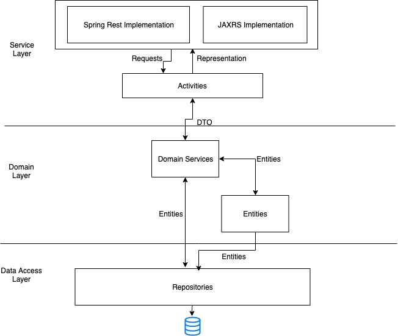
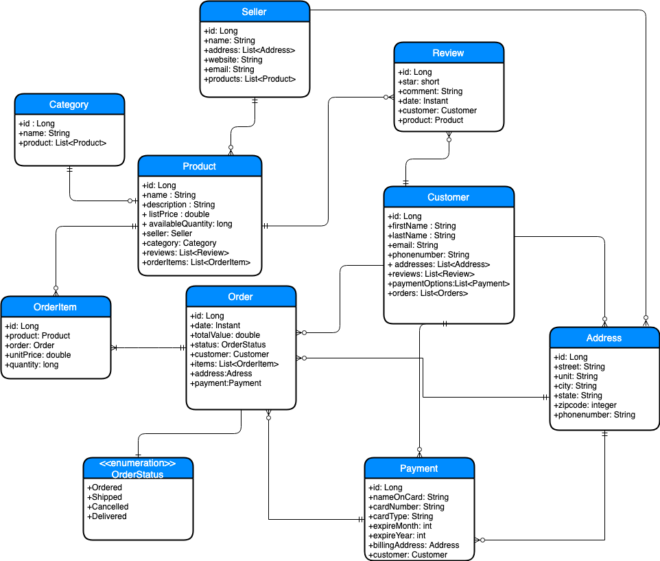

# Project - 3

## Contributors
* Uuganbold Tsegmed ([utsegmed@luc.edu](mailto:utsegmed@luc.edu)) (http://github.com/uuganbold)
* Wei Zhang ([wzhang5@luc.edu](mailto:wzhang5@luc.edu)) (http://github.com/clutchfactor94941)
* Nigel Castelino ([ncastelino@luc.edu](mailto:ncastelino@luc.edu)) (https://github.com/ncastelino)

## Goal 
In this project, we implemented our eCommerce systems's web api. 

This project is hosted on github.com : [Github.com Repository](https://github.com/uuganbold/comp433-ecommerce)

This project is deployed on the AWS : http://18.220.199.235:8080/ecommerce/   

## Architecture

We are using springframework as an architectural framework and Hibernate as an ORM framework.
This webapp's architecture would be seen like below so far.

The application has three layers: Service, Domain, and Data access layer 

### 1. Service Layer:

This layer (**in api directory**), generally contains three kinds of objects.
* Web Services (as for RESTful - Resources) - We implemented Web services with both SpringMVC (RestControllers) and
and CXF (Resources) just to learn them.
* Payloads - Mapped objects of information received from clients (Requests) and information sent to clients (Representation)
* Activities (workflows) - The interface to access to domain layer. Performs external logic of the system. It maps payloads into DTO and vice versa. 

### 2. Domain Layer:

This layer contains three kinds of objects. 
* Models (**in domain dir**) -  Performs internal business logic along with Domain Services. We implemented them with Hibernate Entities.

Entity Relationship Diagram would look like below.

* DTO (Data Transfer Objects) - Represents information sent to service layer and received from service layer.
We use this objects for that purpose instead of using Entities for reasons listed below. 
    1. Entities contains business logic within them and we does not want to expose those logic to service layer.
    2. In our case, Entities can access directly Data Access layer. So we would have allowed service layer 
     power to stimulate data access operations.
     
* Domain Services - Performs internal business logic along with Models.

### 3. Data Access Layer:

We implemented Data Access Layer with Spring-Data-Jpa Repositories. So we have Repository object for each and every Entities.
These Repositories are responsible for accessing Database and persisting the entities. 

## Available Services

*Base URI*
* Spring Implementation: http://18.223.188.97:8080/ecommerce/app
* CXF Implementation: http://18.223.188.97:8080/ecommerce/cxf

1. Category

| URI  |  METHOD | PAYLOAD  | PURPOSE  |
|---|---|---|---|
| `/categories` | POST  | name  |  Creates new category |
| `/categories`  | GET  |   | Return all categories  |
| `/category/{id}`  | GET  |   | Return a category having id received  |
| `/category/{id}` | PUT | name | Update category |
| `/category/{id}` | DELETE | | Deletes category having id received |

2. Seller

| URI  |  METHOD | PAYLOAD  | PURPOSE  |
|---|---|---|---|
| `/sellers` | POST  | name, website, email  |  Creates new seller |
| `/sellers`  | GET  |   | Return all sellers  |
| `/seller/{id}`  | GET  |   | Return a seller having id received  |
| `/seller/{id}` | PUT | name, website, email | Update seller |
| `/seller/{id}` | DELETE | | Deletes seller having id received |
| `/seller/{id}/addresses` | POST | country, street, unit, city, state, zipcode, phonenumber | Adds seller's address |
| `/seller/{id}/addresses` | GET | | Returns seller's all addresses |
| `/seller/{id}/address/{aid}` | DELETE | | Deletes seller's address |

3. Product

| URI  |  METHOD | PAYLOAD  | PURPOSE  |
|---|---|---|---|
| `/products` | POST  | name description listPrice availableQuantity sellerId categoryId  |  Creates new product |
| `/products`  | GET  |   | Return all products  |
| `/product/{id}`  | GET  |   | Return a product having id received  |
| `/product/{id}` | PUT | name description listPrice availableQuantity sellerId categoryId | Update product |
| `/product/{id}` | DELETE | | Deletes a product having id received |
| `/products?q={query}`| GET | | Search product with query received |

4. Customer

| URI  |  METHOD | PAYLOAD  | PURPOSE  |
|---|---|---|---|
| `/customers` | POST  | firstName, lastName, email, phonenumber  |  Creates new customer |
| `/customers`  | GET  |   | Return all customers  |
| `/customer/{id}`  | GET  |   | Return a customer having id received  |
| `/customer/{id}` | PUT | firstName, lastName, email, phonenumber| Update customer |
| `/customer/{id}` | DELETE | | Deletes customer having id received |
| `/customer/{id}/addresses` | POST | country, street, unit, city, state, zipcode, phonenumber  | Adds customers's address |
| `/customer/{id}/addresses` | GET | | Returns customer's all addresses |
| `/customer/{id}/address/{aid}` | DELETE | | Deletes customer's address |
| `/customer/{id}/payments` | POST | nameOnCard, cardNumber, expireMonth, expireYear, addressId  | Adds customer's payment option |
| `/customer/{id}/payments` | GET | | Returns customer's all payment options |
| `/customer/{id}/payment/{pid}` | DELETE | | Deletes customer's payment option |

5. Review

| URI  |  METHOD | PAYLOAD  | PURPOSE  |
|---|---|---|---|
| `/reviews` | POST  | productId, customerId, star, comment  |  Creates new review |
| `/reviews`  | GET  |   | Return all reviews  |
| `/review/{id}`  | GET  |   | Return a review having id received  |
| `/review/{id}` | PUT | productId, customerId, star, comment| Update review |
| `/review/{id}` | DELETE | | Deletes review having id received |

6. Order

| URI  |  METHOD | PAYLOAD  | PURPOSE  |
|---|---|---|---|
| `/orders` | POST  | customerId addressId paymentId items: &nbsp;&nbsp;&nbsp;&nbsp;productId &nbsp;&nbsp;&nbsp;&nbsp;quantity |  Creates new order |
| `/orders`  | GET  |   | Return all orders  |
| `/order/{id}`  | GET  |   | Return a order having id received  |
| `/order/{id}/cancel` | PUT | | Cancels a order having id received |
| `/order/{id}/ship` | DELETE | | Updates order status to shipped |
| `/order/{id}/deliver` | DELETE | | Updates order status to delivered     |
